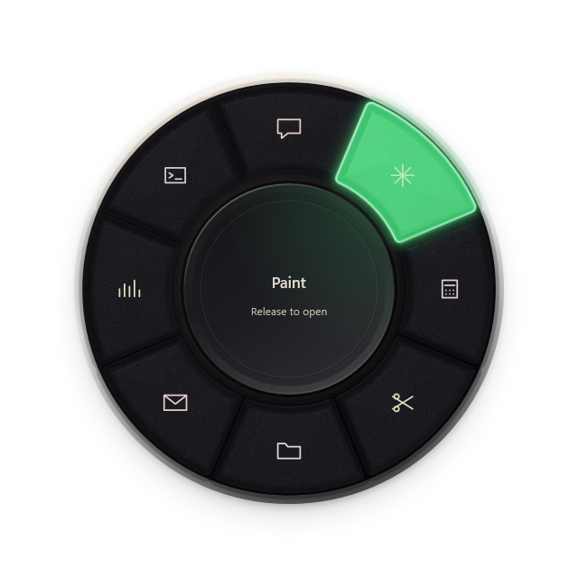

  

<h1 align="center">Index</h1>

  A fast radial launcher for Windows.

## One gesture. Eight destinations.

Hold your shortcut, move toward an app, and release. Index turns a familiar mouse gesture into a quick, visual way to open the tools you use most.

- **Immediate** — summon the wheel from anywhere without breaking focus.
- **Visual** — recognize destinations by position, icon, and color.
- **Personal** — assign eight apps and tune the shortcut to your workflow.
- **Quiet** — Index lives in the notification area until you need it.

## Download

The first public release is being prepared. When it is ready, download the Windows installer from [Releases](https://github.com/robertbradley-oss/index-releases/releases).

After the initial installation, Index will check this release channel for updates and offer a simple **Restart to update** action when a new version is ready.

> No public installer has been published yet.

## System requirements

- Windows 11, version 24H2 or newer
- 64-bit PC

## About this repository

This is the official distribution channel for Index installers and automatic-update packages. The application source is maintained privately and is not published here.
