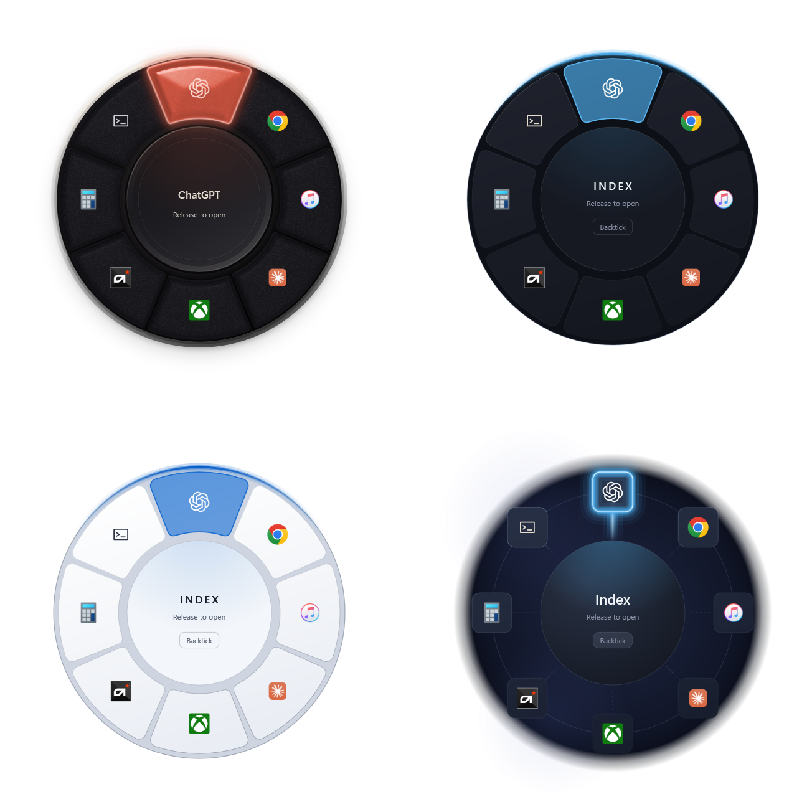

<h1 align="center">Index</h1>

  A fast radial launcher for Windows.

Hold your shortcut, move toward an app, and release to open it. Assign up to eight apps and choose your shortcut in Settings. Index stays in the notification area until you need it.

## Themes

Index includes four selectable wheel themes. These transparent captures come directly from the 2.2.1 renderer using a real Index configuration and vendor application icons, so they stay clean in both light and dark GitHub themes.

Full-size captures: [Signature](./assets/themes/signature.png) · [Pro](./assets/themes/pro.png) · [Daylight](./assets/themes/daylight.png) · [Constellation](./assets/themes/constellation.png)

## New in 2.2.2

- Refresh installed apps without reopening Settings, preserving assignments, search, and selection.
- More reliable app selection, keyboard focus, and application discovery when Settings closes.
- Improved scrolling in compact Settings windows so app picker and slot-order controls remain reachable.
- Corrected Settings text and cleaned up animation subscriptions when the wheel hides.

## New in 2.2.1

- In Hold mode, clicking the center of the wheel now brings Settings to the foreground instead of opening it behind the active app.

## Added in 2.2.0

- **Daylight** uses the Pro layout with a light, frosted appearance and your Windows accent color.
- **Constellation** places eight tiles around a central hub and highlights the selected direction.
- The Theme setting now describes all four choices: Signature, Pro, Daylight, and Constellation.
- Signature and Pro keep their established appearance and behavior.

## Download

**Current stable release: Index 2.2.2**

[Download Index for Windows](https://github.com/robertbradley-oss/index-releases/releases/latest), then choose the `Index-Setup-<version>-x64.exe` installer.

After the initial installation, Index checks this release channel for updates. It verifies each download, waits until the wheel and Settings are closed, installs the update per-user, and relaunches automatically. Your configuration remains in `%LocalAppData%\Index\settings.json`.

> [!WARNING]
> **Index is currently unsigned.** Windows may show a **Windows protected your PC** or unknown-publisher warning. Download Index only from this repository and install it only if you are comfortable proceeding past that warning. HTTPS and published checksums protect download integrity but do not replace publisher code signing, which is planned for a future release.

## System requirements

- Windows 11, version 24H2 or newer
- 64-bit PC

## About this repository

This is the official distribution channel for Index installers and automatic-update packages. The application source is maintained privately and is not published here.
